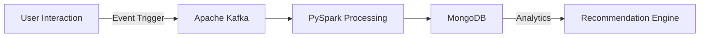

# Hi, I'm Shubham Kulkarni! 👋  
🚀 **Building scalable systems and driving data-powered insights.**

---

## 💡 About Me  
- 🧠 **Problem Solver**: Passionate about real-time systems and machine learning applications.  
- 🌟 **Tech Enthusiast**: Always exploring cutting-edge tools and technologies.  
- 🌐 **Collaborator**: Love working in dynamic teams to deliver impactful solutions.

---

## 🛠️ Skills Overview

| **Languages**   | **Frameworks**     | **Tools**         | **Cloud Platforms** |
|------------------|--------------------|-------------------|---------------------|
| Python, Java     | Flask, React       | Docker, Airflow   | AWS, Azure, GCP     |
| Golang, C++      | TensorFlow, PyTorch| Kubernetes, CI/CD | MongoDB, PostgreSQL |

---

## 🌟 Featured Projects

### **Real-Time Event Processing System**  
[🔗 GitHub Repo](https://github.com/Shubham-andy7/realtime-event-processing)  
- Captured **10k+ website interactions monthly** for enhanced personalization.  
- Built with **Kafka, MongoDB, PySpark, and Flask** for scalability and 99.9% uptime.  

---

### **YouTube Data Analysis with AWS**  
[🔗 GitHub Repo](https://github.com/Shubham-andy7/YouTube_Analysis_AWS)  
- Designed an **ETL pipeline** to process **50,000+ daily records**.  
- Leveraged **AWS Athena, Lambda, S3**, and QuickSight for dashboards.

---

### **AI Interactive Learning Framework**  
[🔗 GitHub Repo](https://github.com/Shubham-andy7/NOW-YOU-KNOW-AI-HACKATHON)  
- Developed an AI-driven platform using **Fetch.AI**, **Claude API**, and **OpenAI APIs**.

---

## 📊 GitHub Stats  

  
  

---

## 🏆 Certifications & Achievements

### Certifications  
- **Microsoft Certified: Azure Data Engineer Associate**  
- **Microsoft Certified: Azure Fundamentals**

  
  

### Achievements  
- 🥋 Represented **India internationally** in martial arts.  
- 🏅 State and national sports champion in **volleyball, wrestling, judo, and more**.

---

## 🌱 Currently Exploring  
- **Real-Time Data Systems**: Optimizing performance and scalability.  
- **Advanced AI Models**: Tools like **Hugging Face**, **LangChain**, and cutting-edge NLP.

---

## 🤝 Let’s Connect  

  
  
  

